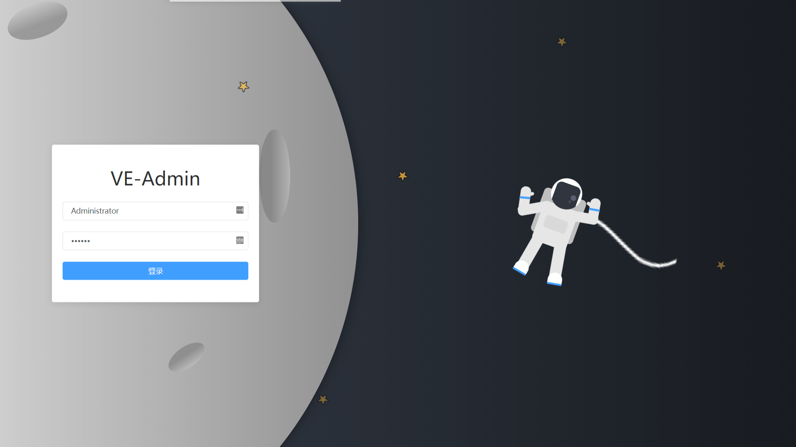
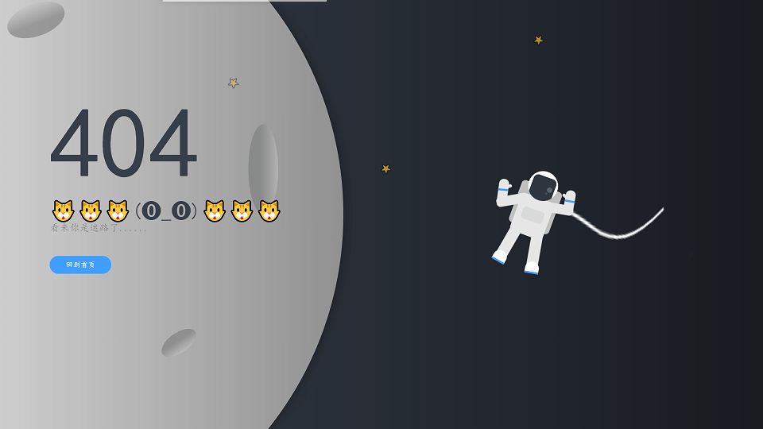
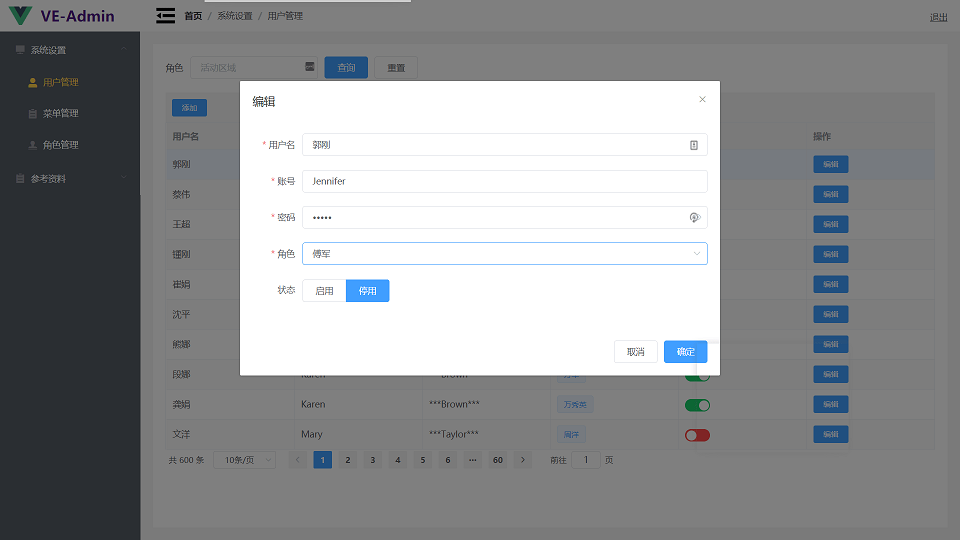
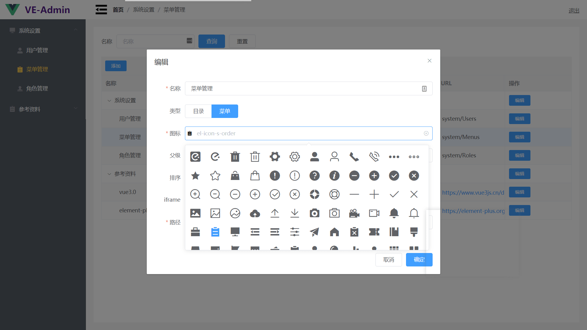
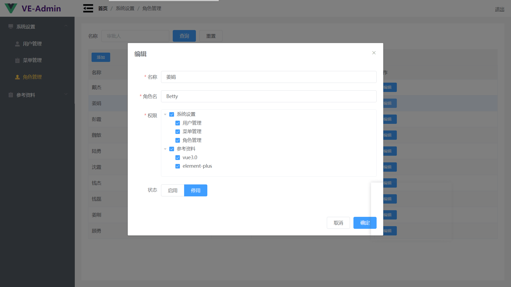
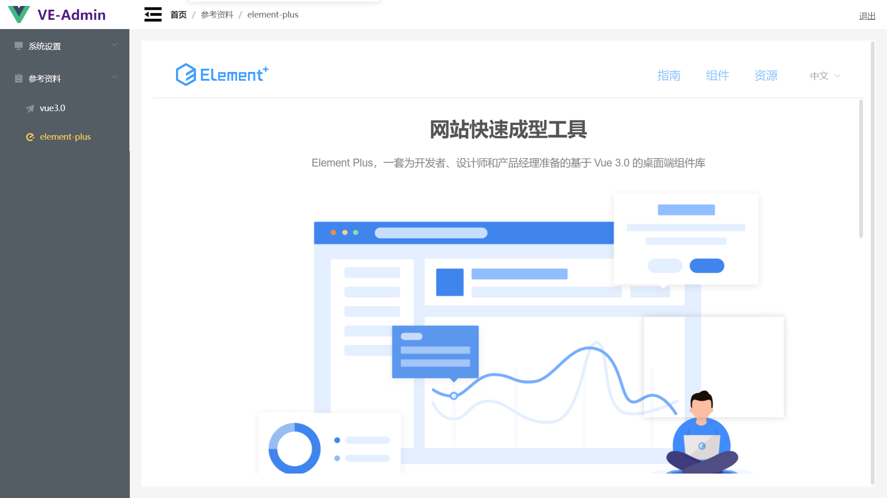
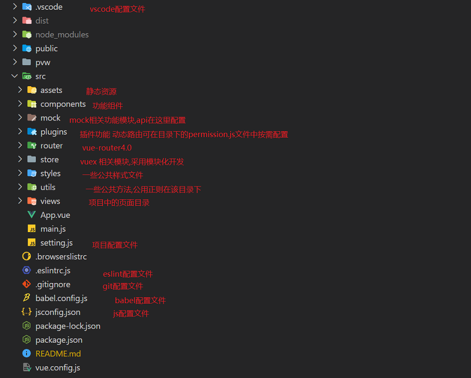

<!--
 * @Author: your name
 * @Date: 2021-01-07 09:49:49
 * @LastEditTime: 2021-04-08 10:24:48
 * @LastEditors: Please set LastEditors
 * @Description: In User Settings Edit
 * @FilePath: \vue3-element-admin\README.md
-->

# vue3-element-admin

**[✈ 国内加速链接](https://gitee.com/asaasa/vue3-element-admin)**   
**[✈ 效果预览](https://vue3-element-admin.vercel.app/)**   
**[✈ 效果预览(备用地址)](http://asaasa.gitee.io/xujianhua)**   
**走过路过的老铁,帮忙点个小⭐⭐⭐⭐⭐,🤝🤝🤝🤝🤝,🙏🙏🙏🙏🙏**
基于**vue3**和**element-plus**开发的企业后台管理模板.
___

## 功能特性

项目使用了最新的**vue3全家桶**+**element-plus**+**mockjs**+**axios**+**eChart5**.项目继成了**mockServe**,可脱离后端自主开发测试
对**axios**深度封装,采用动态路由,路由配置更简单,**mockServe**独立开发测试时可在nodework直观查看接口数据   
基于node实现自动化开发

## 环境依赖

**node 14+**, **vueCli 4+**

## 部署步骤

**npm i** 
**npm run serve**

## 目录结构描述

## 使用文档

### 自定义指令

**v-permission="[array]"**
自定义权限指令,参数为一个数组,数组元素为按钮所对应的key值

~~~js
<el-button
    v-permission="['add']"
    size="mini"
    type="primary"
    @click="handleEdit(menus.add.name)"
    >{{ menus.add.name }}
</el-button>
~~~

**v-resize="myChart"**
监听 echart 容器的自定义指令,参数为 echart 实例

~~~js

~~~

### 动态路由

动态路由的配置可查看 [src\plugins\permission.js](src\plugins\permission.js)  
主要原理就是根据后端接口返回的树形菜单数据,动态生成路由表并挂载.具体需求字段可在[src\plugins\permission.js](src\plugins\permission.js)中的**fnAddDynamicMenuRoutes**方法中进行配置修改

~~~js
let route = {
    path:menuList[i].url.replace(/\//g, "-") + `-${menuList[i].id}`,
    component: null,
    name: menuList[i].url.replace(/\//g, "-") + `-${menuList[i].id}`
    // meta: {
    // }
};
// url以http[s]://开头, 通过iframe展示
if (menuList[i].iframe == 1) {
    route["path"] = `i-${menuList[i].id}`;
    route["name"] = `i-${menuList[i].id}`;
    route["props"] = { url: menuList[i].url };
    route["component"] = () => import("@/views/IFrame.vue");
} else {
    const l = "views/layoutpages/" + menuList[i].url;
    route["component"] = () => import("@/" + l + ".vue");
}
routes.push(route);
~~~

根据需求可以添加更多路由配置或定制化字段,如路由别名等

### 接口配置

项目中对axios做了封装配置中添加**Global**字段用来控制是否显示全屏load,默认为true,如需修改添加axios配置可在[src\plugins\axios.js](src\plugins\axios.js)中进行

#### 添加接口

本项目对mock做了深度集成,在使用其他项目时,mock接口和项目接口往往都是分开维护很不方便.所以就放在了一起.只用在一处添加即可.接口目录为[src\api\modules](src\api\modules)**不要修改此目录名称**.在该目录下添加对应的接口文件.

~~~js
module.exports = {
    login: {                  //接口名称  必须
        url: "/login",        //接口地址  必须
        type: "post",         //请求类型  必须
        mock: true,           //mock细粒度控制开关,非必须,不填则为false
        response: opt => {    //启用mock时的返回数据  opt为请求数据头
            const {
                body: { userName, pwd }
            } = opt;
            let data = {
                code: "00",
                message: "登录成功!",
                token: new Date().getTime(),
                uname: userName
            };
            if (userName == "Administrator") {
                if (pwd != "123456") {
                    data = {
                        code: "01",
                        message: "密码错误"
                    };
                }
            }
            return data;
        }
    }
}
~~~

必须使用**module.exports**导出

#### 接口的使用

项目中已将封装后axios实例挂载到自定义字段window.VE_API上.调用方式为:  
~~~js
VE_API [ fileName ][ portName ] (params,[config])   //有全局loading
VE_API [ fileName ][ portName ] (params,{Global:false)   //没有全局loading
~~~
### 菜单配置

项目中的菜单时根据后端返回的树形结构数据动态生成,具体可查看[src\components\layout\components\SlideMenu.vue](src\components\layout\components\SlideMenu.vue)

## 声明

个人开发维护! 欢迎交流学习!
